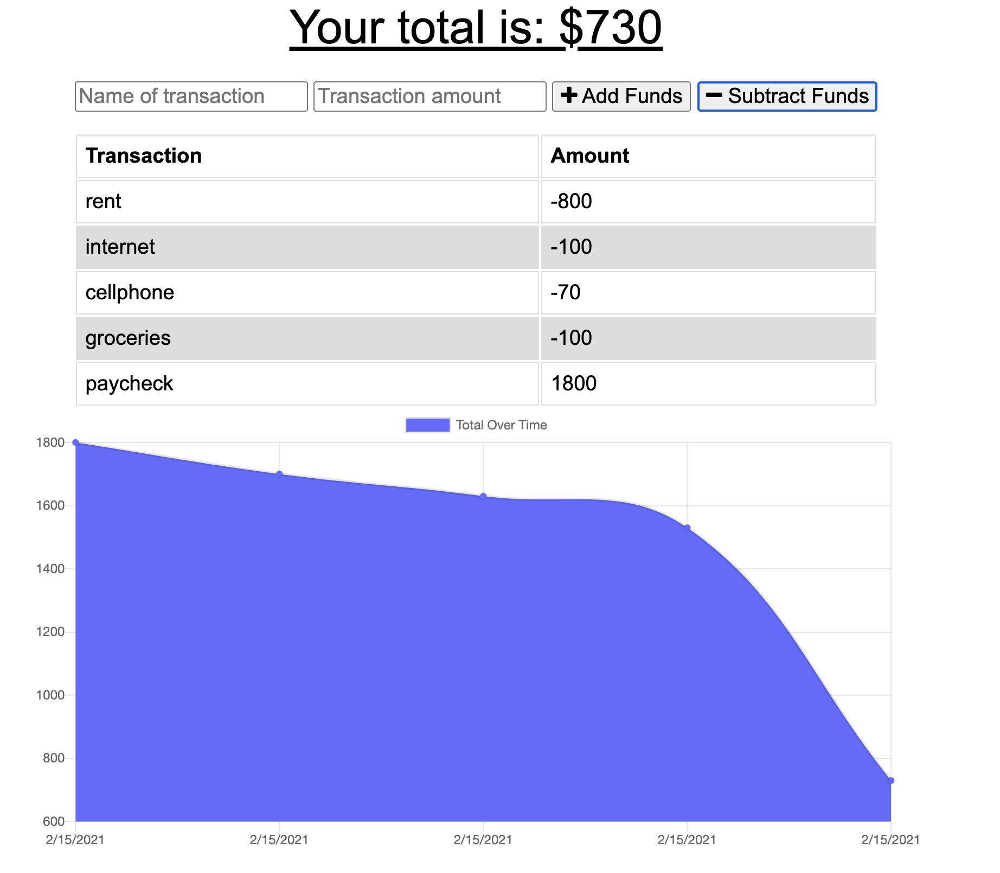

# budget-tracker

Intro to the Budget Tracker
This is a simple application that is used to track you budget. You can easily type in the name of the transaction and either add funds or subtract funds from your total.

# Link to deployed application

https://damp-scrubland-72782.herokuapp.com/

Technologies Used
- MongoDB
- Compression
- Morgan 
- Express
- Nodemon
- Mongoose  
- Lite-server
- Heroku
- this app was deployed via Mongo Atlas

Installation Instructions
Simply click on the Heroku link and you're all set!